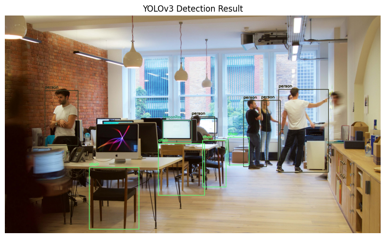

# 🚀 YOLOv3 Object Detection with OpenCV

This project demonstrates how to implement YOLOv3 object detection using OpenCV's DNN module.

## 🔧 Model
- YOLOv3 (`.cfg` and `.weights`)
- Framework: OpenCV DNN
- Detection on static images

## 📦 Files Used
- yolov3.cfg
- yolov3.weights
- coco.names

## 🎯 Pipeline
1. Load YOLO model with OpenCV
2. Read and preprocess image
3. Run inference using DNN
4. Apply NMS to remove overlapping boxes
5. Draw detections on the image

## 🖼️ Sample Output

